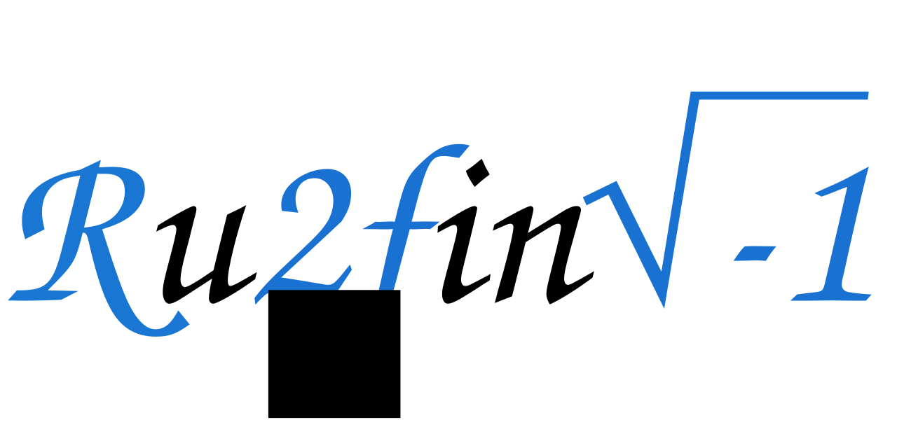

<p align="center">
    
</p>

**Ruffini** (/rʊˈfiːni/, reference to [Paolo Ruffini](https://en.wikipedia.org/wiki/Paolo_Ruffini), Italian mathematician) is a simple python library to compute monomials and polynomials.


## Getting Started

### Installing
You can easily install the most recent version of `ruffini` package by downloading it from Python Package Index (PyPI) just doing:
```
pip install ruffini
```

Instead, if you want to download and install it from the source, you have to do:
```
git clone https://github.com/gianluparri03/ruffini.git
cd ruffini/src
python3 setup.py install
```

### How To
In this moment, the documentations for this project are available only in its [website](https://gianluparri03.github.io/ruffini). 


## Authors

* **Parri Gianluca** - *Creator and main developer* - [@gianluparri03](https://github.com/gianluparri03)

See also the list of [contributors](https://github.com/your/project/contributors) who participated in this project.


## License

This project is licensed under the MIT License - see the [LICENSE.md](LICENSE.md) file for details
